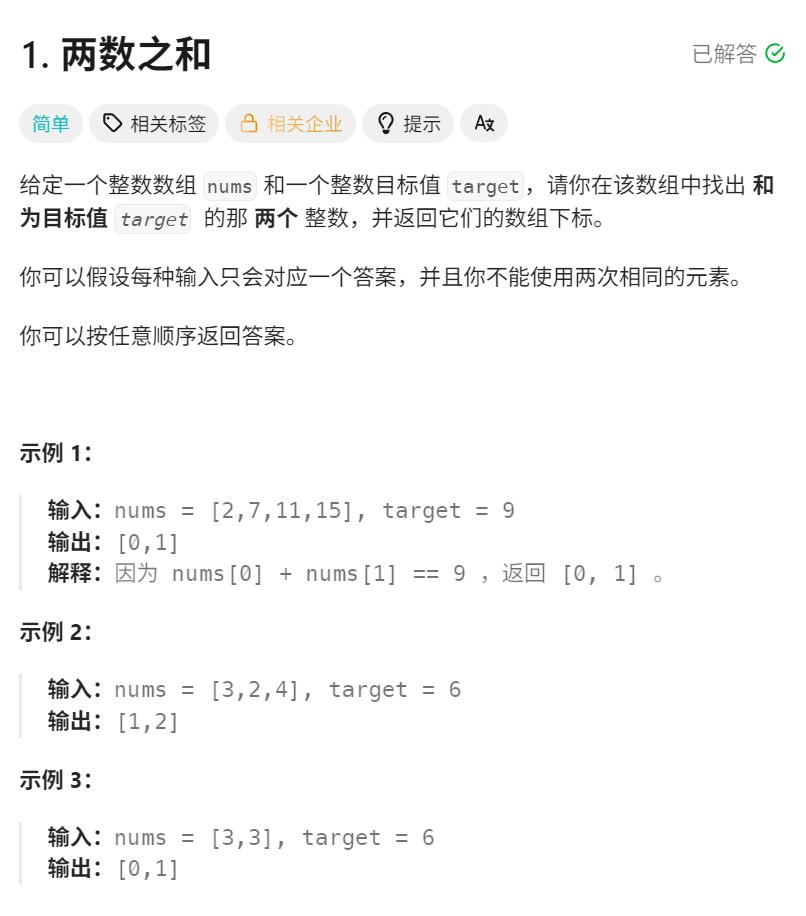
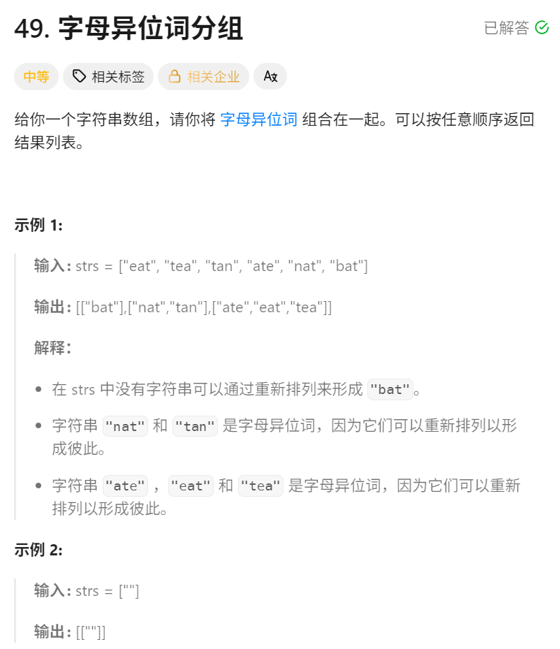
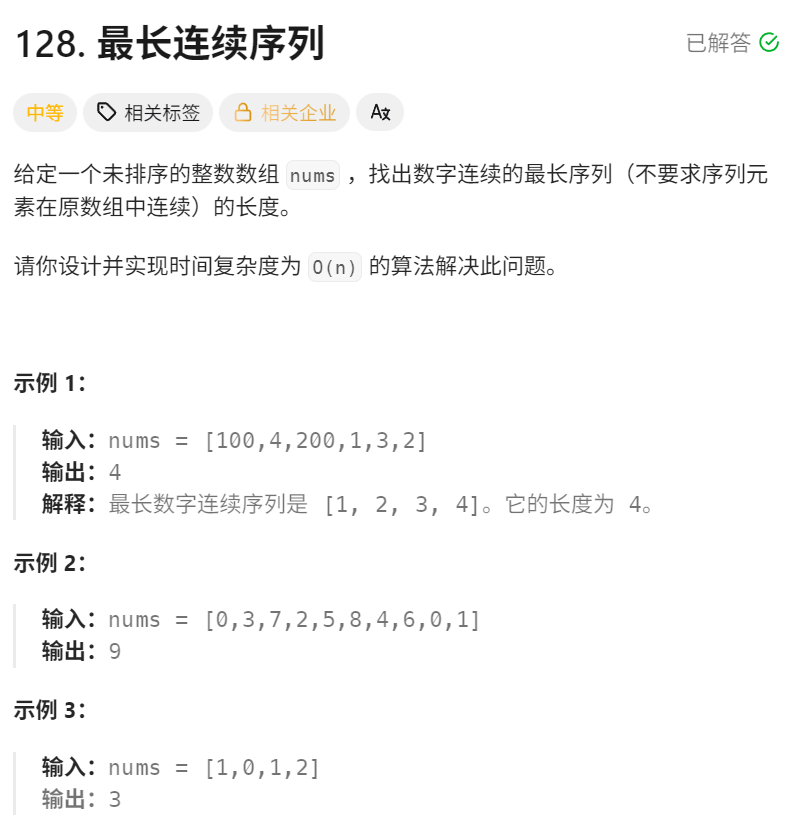

今天更新一篇哈希表的博客，应该算是最基础的leetcode里面的题目之一了。哈希表我认为它的核心奥义就在于用空间换时间，很多的教程上来就讲复杂度，其实很难有实感，我尽可能说的清楚一些。

---

## 一、哈希表到底是个啥？

### 1. 字典

哈希表听起来很高级，但它在 Python 里就是最熟悉的 **字典 (`dict`)**。
我举一个例子，比如说逛商场的时候需要存包，数组list就像有一排柜子，要找到包需要从第一个开始找，运气不好的话要找到最后面，这就是O(n)的时间复杂度，非常慢。
哈希表就像是那种带凭条的储物柜，按一下凭条，或者说是key，柜门就会直接弹开，拿到包，也就是value。这就是O(1)的时间复杂度，非常快。

### 2. 核心奥义
有种高中做题的感觉，如果题目里面能读出这种问法，我觉得就可以联想一下哈希表了。
*   **“有没有出现过？”**
*   **“某个东西在哪里？”**
*   **“把同一类的归在一起”**
它的核心思想就是：**用空间（多存一份记录）来换取时间（极速查找）。**

---

## 二、leetcode hot 100里面的三题

我也只做过这三个哈希表的题目，相当于写一个题解了。
### 题目 1：两数之和 (LeetCode 1)

> **人话**：给你一堆数字 `[2, 7, 11, 15]`，目标是 `9`。请你找出哪两个数加起来等于 9？

#### ❌ 遍历

我先拿 `2`，然后去后面挨个问：你是 7 吗？你是 7 吗？
如果数组有一万个数，这种两层循环的做法 ($O(N^2)$) 很慢，也不符合这个题的时间要求。

#### ✅ 哈希
我要获取足够多的信息的话，是至少需要遍历一遍的。但是像刚才所说的直接遍历的话，问题就在于我遍历的时候完全没有利用信息，我只做了比较，然后就比下一个，我是没有获取到什么其他的信息的。
所以说，我们在遍历数组时，能不能**记笔记**？

*   **思路**：
    我走到 `2`，我想：“如果后面有个 `7` 就好了”。我把 `2` 的位置记在小本本上。
    我走到 `7`，我想：“如果后面有个 `2` 就好了”……等等！我查一下，**前面是不是出现过 `2`？**
    查到了！那 `2` 和 `7` 就是一对。

#### 💻代码详解
```python
class Solution:
    def twoSum(self, nums: List[int], target: int) -> List[int]:
        # Key存数字，Value存这个数字的下标
        a = {}#哈希就是一个字典，所以在这里先设一个空字典就相当于建好哈希表了
        
        for i, num in enumerate(nums):
            # 1. 计算需要的“另一半”
            need = target - num
            
            # 2. 查：另一半之前出现过吗？
            if need in a:
                # 返回另一半的下标和当前下标
                return [a[need], i]
            
            # 3. 没找到：把自己记在哈希表上，给后面的数当“另一半”
            a[num] = i
            
        return []
```

---

### 题目 2：字母异位词分组 (LeetCode 49)

> **人话**：给一堆单词 `["eat", "tea", "tan", "ate", "nat", "bat"]`。请把字母一样、只是顺序不同的单词归到一组。
> 结果应该是：`[["eat", "tea", "ate"], ["tan", "nat"], ["bat"]]`

#### ✅ 哈希
这个题目的关键就在于怎么构建这个哈希表，哈希表里面存的是什么。题目里面提到的是，要求我们把字母一样顺序不一样的归到一组，其实我们可以发现的是，26个字母本身就是有顺序的，我们对于所有的单词做一个排序，排序后的单词就是当前单词的哈希表里面的表示。
我们要给每一组单词发一个**“身份证”**。
*   `eat` 的身份证是 `aet` (字母按 a-z 排序)。
*   `tea` 的身份证也是 `aet`。
*   `ate` 的身份证还是 `aet`。

只要身份证一样，就丢进同一个分组里。

*   **Python 坑点**：
    字典的 Key 必须是**不可变**的。排序后的结果 `['a', 'e', 't']` 是列表（可变），不能做 Key。必须把它转成元组 `('a', 'e', 't')` 或者字符串 `"aet"`。

#### 💻 代码详解
```python
class Solution:
    def groupAnagrams(self, strs: List[str]) -> List[List[str]]:
        # defaultdict 是一个好东西，如果 Key 不存在，它会自动创建一个空列表
        group_map = defaultdict(list)
        
        for s in strs:
            # sorted("eat") -> ['a', 'e', 't']
            # tuple(...) -> ('a', 'e', 't')
            key = tuple(sorted(s))
            # 同一个分组的加到一个列表里面，这个有点像哈希冲突的感觉，只要是一个分组的就在同一个链表上
            group_map[key].append(s)
            
        # 3. 把所有分组拿出来
        return list(group_map.values())
```

---

### 题目 3：最长连续序列 (LeetCode 128)

> **人话**：给你乱序数组 `[100, 4, 200, 1, 3, 2]`。找里面最长的连号数字。
> 这里连号的是 `1, 2, 3, 4`，长度是 4。

#### ❌ 排序
先排个序：`[1, 2, 3, 4, 100, 200]`，然后数一下就完了。
**问题**：题目要求时间复杂度 $O(N)$。排序最快也要 $O(N \log N)$，这里会超时

#### ✅ 哈希
集合有去重的属性，所以我们先转换成集合，会方便一些。

我们可以想象大家在排队：
*   拿到 `100`：看看 `99` 在不在？不在。那 `100` 可能是个**队头**。往后数 `101` 在不在？不在。长度 1。
*   拿到 `4`：看看 `3` 在不在？**在！** 说明 `4` 肯定不是队头（它跟着 3 呢）。**直接跳过，不用数！**
*   拿到 `1`：看看 `0` 在不在？不在。**`1` 是龙头！**
    *   数 `2` 在吗？在。
    *   数 `3` 在吗？在。
    *   数 `4` 在吗？在。
    *   数 `5` 在吗？不在。
    *   长度 4。

**精髓**：只有当一个数是队头（前一个数不存在）时，才开始数数。这样每个数最多只会被访问两次，速度极快。

#### 💻 代码详解
```python
class Solution:
    def longestConsecutive(self, nums: List[int]) -> int:
        # 1. 先把数字全部倒进 Set，去重且查找快
        num_set = set(nums)
        max_len = 0
        
        for num in num_set:
            # 2. 剪枝：只从队头开始数
            # 如果 num - 1 在集合里，说明 num 肯定不是开头，直接跳过
            if (num - 1) not in num_set:
                current_num = num
                current_len = 1
                
                # 3. 是队头，就开始往后数
                while (current_num + 1) in num_set:
                    current_num += 1
                    current_len += 1
                
                # 4. 记录最长的长度
                max_len = max(max_len, current_len)
                
        return max_len
```

---

## 总结
当你想用循环去“找”某个东西时，先停下来，想想能不能用哈希表（字典/集合）把它存起来，下次直接查。我也是相当于只会这三个题，理解的还是不够深入，继续努力。